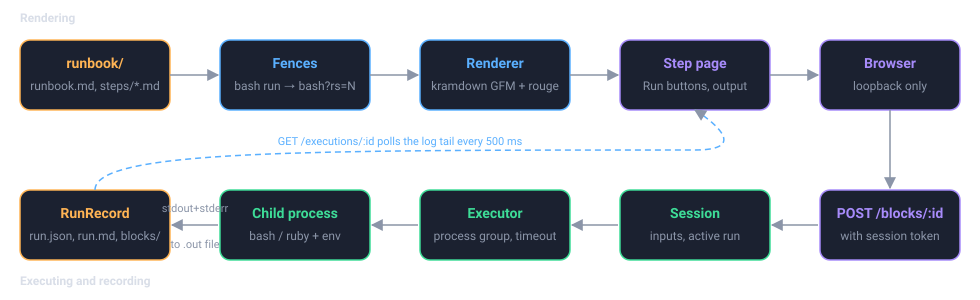

# runsheets

**Executable runbooks.** A directory of markdown files becomes a local web
page where the steps read like a doc site, the commands the author marked as
runnable get a Run button, and everything that happens during a run is
recorded: the exact command, its output, exit status, timing, and the
operator's acknowledgements of the manual steps.

The rendering is the vehicle. The run record, the *runsheet*, is the point.

<div class="diagram" markdown>

</div>

## Why

Operational runbooks are prose with commands in them. An operator reads a
step, copies the command into a terminal, eyeballs the output, and moves on.
Nothing records what was run, what came back, or who confirmed the manual
steps. Authoring guides ask operators to "test the runbook by following it"
and to "date the last verification" by hand, and neither happens reliably.

runsheets closes that gap:

- The runbook renders as HTML, so it reads as well as any doc site.
- Fenced blocks the author marks as executable get a Run button.
- Every execution and its output is captured, in order, into a run record.
- Manual steps are acknowledged by the operator and that acknowledgement is
  recorded.
- The record lives outside the runbook, so captured output never lands next
  to the docs in a repository.

## What it is not

- **Not a remote execution service.** It is a script an operator starts on
  their own machine, with their own shell environment, credentials, SSO
  sessions and tunnels. It binds to loopback and has no multi-user story.
- **Not a workflow engine.** Steps are visited in order but the operator can
  jump around. The record keeps the real sequence, so skipping is visible
  rather than prevented.
- **Not a replacement for reading.** Blocks run only when the author opted
  them in and the operator clicked. Everything else is inert text.

## Quick start

```bash
gem install runsheets
git clone https://github.com/MadBomber/runsheets
runsheet --open runsheets/examples/hello
```

The example runbook is safe to run end to end. Start a run from the landing
page, click Run on the first step, mark it done, and look at the run record
that appears under `~/.local/share/runsheets/runs/hello/`.

## Where to go next

<div class="grid cards" markdown>

- **[Getting Started](getting-started.md)**

    Install, run the example, and walk through a complete run.

- **[Writing Runbooks](runbooks/index.md)**

    The directory layout, front matter, the fenced block convention, inputs
    and secrets.

- **[Running](running/index.md)**

    The command line, the web page, the execution model, and what the run
    record contains.

- **[Reference](reference/security.md)**

    Security posture, architecture, the Ruby API, and the HTTP endpoints.

</div>

## Status

All four milestones of the [roadmap](roadmap.md) are built: rendering,
executing `bash`, `ruby` and any mapped language such as `sql`, background
processes with Start and Stop, destructive confirmation, terminal and
manual acknowledgements, expected-output panels, secret redaction,
standalone verification runs, the `last_verified` stamp, run history with
drift, single-file runbooks, a scaffold command, and two realistic sample
runbooks. The block convention is settled unless real use argues
otherwise.
