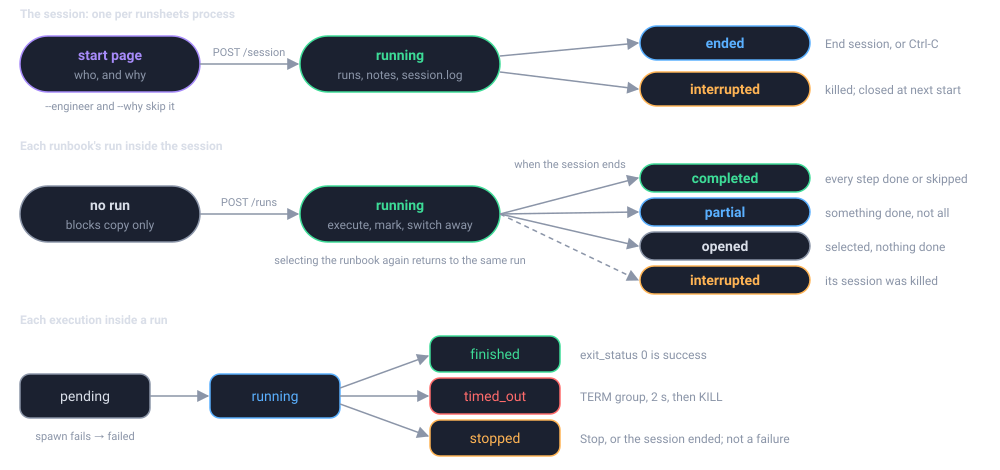

# Running

runsheets is a script an operator starts and stops. It serves one runbook on
loopback, executes blocks on request in the operator's own environment, and
writes a record of each run to disk.

- **[Command Line](cli.md)**

    `runsheets` and its options, exit codes, and the environment variables it
    honours.

- **[The Web Page](web-ui.md)**

    The landing page, step pages, the run lifecycle, status marks, and
    keyboard shortcuts.

- **[Execution Model](execution.md)**

    Fresh process per block, process groups, timeouts, working directory,
    output capture, and what the exit status means.

- **[The Run Record](run-record.md)**

    Where records go, the layout of a run directory, the `run.json` schema
    and the `run.md` transcript.

## One run at a time

A `runsheets` process serves exactly one runbook and holds at most one active
run. Starting a second run while one is active is refused; finish or
abandon the first. To work two runbooks at once, start two processes on
different ports.

## Where the shell comes from

Executed blocks inherit the environment of the shell that started
`runsheets`. If a runbook needs an SSO session, a VPN, a tunnel, or a
particular `PATH`, set those up in the terminal first, then start the
server from it.

