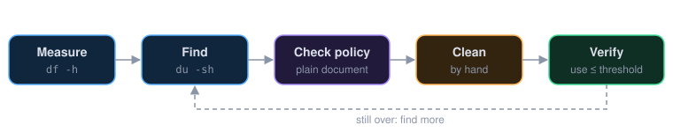

# Cleanup policy

What may be deleted to free space, and what may not. Used by the
[disk space triage](../disk-space-triage.md) runbook. Terms are explained
in the [glossary](../disk-usage-glossary.md).

## Safe to delete

- Build caches and intermediate artifacts the next build recreates.
- Package manager caches (`~/.cache`, `~/.npm/_cacache`, gem and bundler
  caches).
- Rotated and compressed logs older than 14 days.
- Anything under `/tmp` older than a day that no running process holds open.

## Ask first

- Uncompressed logs of a service that is still running. Truncate them
  instead of deleting, so the service keeps writing to the same file.
- Container images and volumes. An unused-looking volume may hold the only
  copy of something.

## Never delete

- Database files, even when the database is stopped.
- Anything under a backup or snapshot directory.
- Files you cannot identify. Find their owner first.

## When something was deleted by mistake

Stop, do not write more to that file system, and contact the owner of the
host. Restore from backup before trying anything clever.
